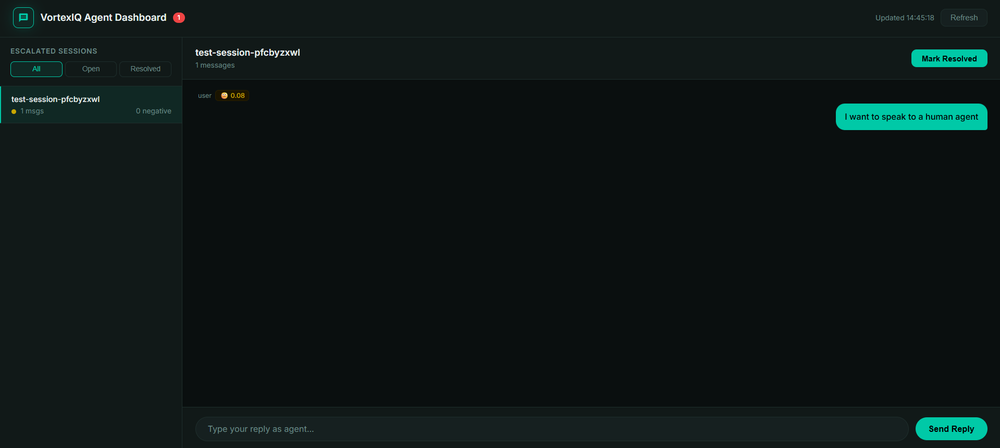

# RAG Support Agent

> An end-to-end support triage prototype — not just a RAG chatbot.

A conversational AI support agent built for VortexIQ as part of an AI Engineering internship project. The system handles the full support loop: document ingestion, grounded answers, out-of-scope fallback, sentiment-based escalation, and a human agent dashboard.

## Live Demo

| | URL |
|---|---|
| 💬 Chat UI | https://astonishing-dusk-bfbffd.netlify.app/index.html |
| 👤 Agent Dashboard | https://astonishing-dusk-bfbffd.netlify.app/agent.html |
| 🔌 API | https://web-production-215bcf.up.railway.app |
| 📚 API Docs | https://web-production-215bcf.up.railway.app/docs |
| 📦 GitHub | https://github.com/Efrrowini/rag-support-agent |

## What it does

- Ingests PDF and web documents into a vector database
- Answers customer support questions using Retrieval Augmented Generation (RAG)
- Refuses to answer out-of-scope questions — hallucination guardrail via cosine similarity threshold
- Detects negative sentiment and escalates frustrated users to human agents in real time
- Provides a live chat UI and a human agent dashboard with session history and resolve flow

## Architecture
PDF / Web Docs → Text Chunker → Embedder (all-MiniLM-L6-v2) → ChromaDB
↓
User Query → Embed → Similarity Search → Groq LLaMA 3.1 → Answer
↓
WebSocket → Sentiment (VADER) → Escalation Gateway → Agent Dashboard

## Tech Stack

| Layer | Technology |
|---|---|
| Backend | FastAPI + uvicorn |
| Vector DB | ChromaDB |
| Embeddings | sentence-transformers/all-MiniLM-L6-v2 |
| LLM | Groq LLaMA 3.1 8B Instant |
| Sentiment | VADER |
| Rate limiting | slowapi |
| Frontend | Vanilla HTML/CSS/JS |
| Backend deploy | Railway |
| Frontend deploy | Netlify |

## Setup

### 1. Clone the repo
```bash
git clone https://github.com/Efrrowini/rag-support-agent.git
cd rag-support-agent
```

### 2. Create virtual environment
```bash
python -m venv venv
venv\Scripts\Activate.ps1  # Windows
source venv/bin/activate    # Mac/Linux
```

### 3. Install dependencies
```bash
pip install -r requirements.txt
```

### 4. Configure environment
Create a `.env` file in the project root:
GROQ_API_KEY=your_groq_api_key
CHROMA_DB_PATH=./chroma_store
SIMILARITY_THRESHOLD=0.80
GROQ_MODEL=llama-3.1-8b-instant
HF_HUB_DISABLE_SYMLINKS_WARNING=1

### 5. Start the server
```bash
uvicorn backend.main:app --reload
```

Documents in `data/` are ingested automatically on startup if ChromaDB is empty.

### 6. Open the chat UI
Open `test_chat.html` in your browser.

### 7. Open the agent dashboard
Open `agent_dashboard.html` in your browser.
Password: `vortexiq-agent-2026`

## Evaluation Results

The system achieves **100% pass rate** on a 35-query evaluation suite spanning 5 documents:
- 30 in-scope questions answered correctly across 5 documents
- 5 out-of-scope questions blocked with structured fallback
- 0% hallucination rate
- Evaluated across: support docs, API reference, troubleshooting, security/compliance, and onboarding

### Reproduce the evaluation

```bash
# Terminal 1 — start the server
uvicorn backend.main:app --reload

# Terminal 2 — run the eval suite
python test_eval.py
```

Expected output:
EVALUATION SUITE — 35 queries across 5 documents
RESULTS: 35/35 passed | 0 failed
Pass rate: 100%

## Benchmark Pack

20 representative support tickets showing system behaviour across all response types:

| # | User Message | Expected Type | Source | Actual Answer (excerpt) | Result |
|---|---|---|---|---|---|
| 1 | How do I reset my password? | Answer | sample.pdf | "Click Forgot Password on the login page. A reset link is sent within 2 minutes..." | ✅ Pass |
| 2 | Is VortexIQ SOC 2 certified? | Answer | security_compliance.pdf | "Yes, VortexIQ is SOC 2 Type II certified with annual audits by a third party." | ✅ Pass |
| 3 | What HTTP status code means rate limit exceeded? | Answer | api_reference.pdf | "429 Too Many Requests means you have exceeded your rate limit." | ✅ Pass |
| 4 | How do I invite a team member? | Answer | sample.pdf | — | ✅ Pass |
| 5 | How do I cancel my subscription? | Answer | sample.pdf | — | ✅ Pass |
| 6 | What roles can I assign to users? | Answer | sample.pdf | — | ✅ Pass |
| 7 | How do I generate an API key? | Answer | sample.pdf | — | ✅ Pass |
| 8 | What is the base URL for the API? | Answer | api_reference.pdf | — | ✅ Pass |
| 9 | How do I create a project using the API? | Answer | api_reference.pdf | — | ✅ Pass |
| 10 | What should I do if VortexIQ loads slowly? | Answer | troubleshooting.pdf | — | ✅ Pass |
| 11 | How do I fix Jira sync issues? | Answer | troubleshooting.pdf | — | ✅ Pass |
| 12 | What file size limit does VortexIQ support? | Answer | troubleshooting.pdf | — | ✅ Pass |
| 13 | How is data encrypted in VortexIQ? | Answer | security_compliance.pdf | — | ✅ Pass |
| 14 | How do I report a security vulnerability? | Answer | security_compliance.pdf | — | ✅ Pass |
| 15 | How do I rename my workspace? | Answer | onboarding_guide.pdf | — | ✅ Pass |
| 16 | How many team members can I invite at once? | Answer | onboarding_guide.pdf | — | ✅ Pass |
| 17 | How do I create my first project? | Answer | onboarding_guide.pdf | — | ✅ Pass |
| 18 | What is the weather in Bangalore? | Fallback | None | "I'm sorry, I don't have information on that in our support documentation." | ✅ Pass |
| 19 | Who won the IPL 2025? | Fallback | None | — | ✅ Pass |
| 20 | Write me a Python function to sort a list. | Fallback | None | — | ✅ Pass |

**Escalation cases tested separately:**
- Keyword trigger: "I want to speak to a human agent" → instant escalation ✅
- Sentiment trigger: 3 consecutive messages with VADER compound score < −0.4 → escalation ✅

## Operator Trace

One complete support session showing all system states:
USER:  "What are the pricing plans?"
BOT:   "VortexIQ offers four plans: Free, Starter ($9/user/mo), Pro ($29/user/mo),
and Enterprise (custom). [source: data/sample.pdf]"
STATE: Normal answer — RAG retrieval successful, score 0.47
USER:  "What is the weather in Bangalore today?"
BOT:   "I'm sorry, I don't have information on that in our support documentation.
Let me connect you with a human agent who can help."
STATE: Fallback triggered — cosine distance 0.91 exceeded threshold 0.80
USER:  "This is absolutely terrible, nothing is working"
BOT:   "I'm connecting you to a human agent now. Please hold on."
STATE: Escalation triggered — VADER score −0.73, keyword "terrible" matched
AGENT: [Opens dashboard — session visible with sentiment scores]
[Reads full conversation history]
"Hi, I'm Alex from VortexIQ support. How can I help you today?"
STATE: Agent reply delivered to user in real time via WebSocket push
AGENT: [Clicks Mark Resolved]
STATE: Session closed — moved to Resolved tab in dashboard


## Prototype Boundaries

This is a working prototype. Current known limitations:

| Component | Current Implementation | Production Path |
|---|---|---|
| Session storage | In-memory dict (resets on restart) | Redis or PostgreSQL |
| Vector DB | ChromaDB on local disk (ephemeral on Railway) | Pinecone or pgvector |
| Agent auth | Shared hardcoded password | JWT with per-agent accounts |
| Sentiment model | VADER (rule-based) | Fine-tuned BERT classifier |
| Helpdesk integration | None | Zendesk / Intercom webhook |
| Escalation routing | Single agent queue | Multi-agent routing with SLA |

## API Endpoints

| Method | Endpoint | Description |
|---|---|---|
| GET | /health | Health check |
| GET | /ready | Readiness check (true after startup ingest) |
| POST | /ingest | Ingest a document |
| POST | /ask | Ask a question (REST, 20 req/min rate limit) |
| GET | /sessions | List escalated sessions |
| POST | /agent-reply/{id} | Send agent reply |
| WS | /chat/{session_id} | Live WebSocket chat |

## Project Structure
rag-support-agent/
├── backend/
│   ├── ingestion/
│   │   ├── loader.py        # PDF and web document loader
│   │   ├── chunker.py       # Text splitter (80-word chunks)
│   │   ├── embedder.py      # Sentence transformer embeddings
│   │   └── pipeline.py      # End-to-end ingestion pipeline
│   ├── vectordb/
│   │   └── store.py         # ChromaDB vector store
│   ├── rag/
│   │   ├── engine.py        # RAG engine with Groq LLM + history
│   │   └── fallback.py      # Out-of-scope fallback handler
│   ├── websocket/
│   │   └── sentiment.py     # VADER sentiment + escalation logic
│   └── main.py              # FastAPI app with all endpoints
├── data/                    # Knowledge base (5 documents, 56 chunks)
├── logs/                    # Interaction logs (JSONL)
├── frontend_deploy/         # Netlify deployment files
├── test_chat.html           # User chat interface
├── agent_dashboard.html     # Human agent dashboard
├── test_eval.py             # 35-query evaluation suite
├── test_integration.py      # 8 pytest integration tests
└── requirements.txt

## Knowledge Base

| Document | Sections | Chunks | Topics |
|---|---|---|---|
| sample.pdf | 12 | ~21 | Account, billing, teams, integrations |
| api_reference.pdf | 8 | ~10 | Auth, endpoints, rate limits, SDKs |
| troubleshooting.pdf | 8 | ~10 | Login, performance, notifications, billing |
| security_compliance.pdf | 7 | 7 | Encryption, SOC 2, GDPR, incident response |
| onboarding_guide.pdf | 7 | 8 | Workspace setup, team invite, training |

## Built by

Efrrowini — AI Engineering Intern, VortexIQ
GitHub: [Efrrowini](https://github.com/Efrrowini)
📝 LinkedIn Post | https://www.linkedin.com/posts/efrrowini_aiengineering-rag-machinelearning-share-7483485289756270592-LtZS/ 